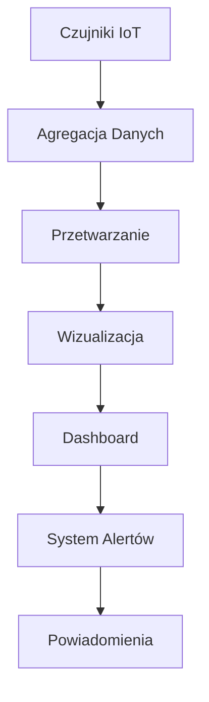
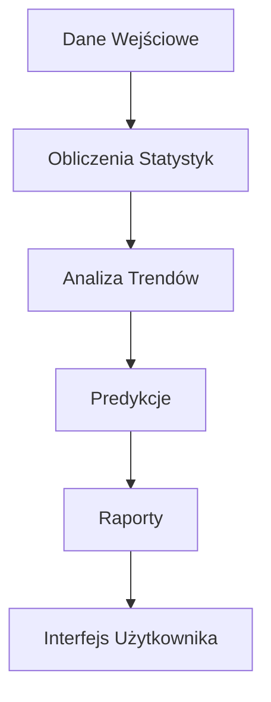
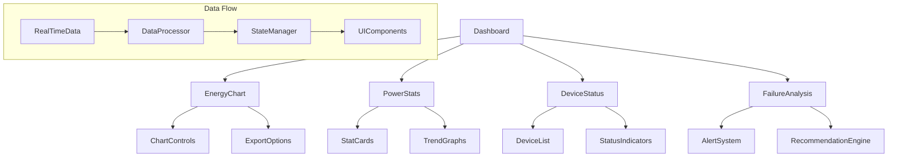

# System Architecture Documentation - Dashboard

## 1. Przegląd Systemu
System implementuje zaawansowany dashboard do monitorowania zużycia energii i zarządzania infrastrukturą energetyczną w czasie rzeczywistym. Główne funkcjonalności obejmują:
- Monitorowanie zużycia energii w czasie rzeczywistym
- Analiza wydajności i trendów energetycznych
- Status urządzeń IoT i czujników
- System alertów i powiadomień
- Integracja z zewnętrznymi systemami pomiarowymi

## 2. Główne Komponenty

### Monitoring Energii (`src/components/dashboard/EnergyChart.tsx`)
- Interaktywne wykresy zużycia energii
- Możliwość przełączania między różnymi typami wykresów
- System eksportu danych (PDF/JPG)
- Funkcje przybliżania i analizy szczegółowej
- **Punkty dostosowania:**
  ```typescript
  // Kolory wykresu
  <Line stroke="#ef4444" /> // Zmień kolor linii
  
  // Konfiguracja legendy
  <Legend 
    verticalAlign="bottom"
    height={36}
  />
  
  // Dostosowanie tooltipów
  <CustomTooltip />
  ```

### Statystyki Mocy (`src/components/dashboard/PowerStats.tsx`)
- Karty z kluczowymi wskaźnikami
- Animowane wskaźniki statusu
- Wykresy trendów
- **Punkty dostosowania:**
  ```typescript
  // Progi statusów
  const getStatusColor = (value: number) => {
    if (value > 80) return "bg-green-500";
    if (value > 50) return "bg-yellow-500";
    return "bg-red-500";
  };
  ```

### Status Urządzeń (`src/components/network/DeviceStatus.tsx`)
- Monitoring transformatorów
- Status liczników energii
- Parametry czujników
- **Punkty dostosowania:**
  ```typescript
  // Konfiguracja statusów
  const deviceStatuses = {
    online: "bg-green-500",
    warning: "bg-yellow-500",
    error: "bg-red-500"
  };
  ```

### Analiza Awarii (`src/components/network/FailureAnalysis.tsx`)
- System wykrywania problemów
- Rekomendacje naprawcze
- Historia awarii
- **Punkty dostosowania:**
  ```typescript
  // Priorytety alertów
  const priorityLevels = {
    high: { color: "red", icon: AlertTriangle },
    medium: { color: "yellow", icon: AlertCircle },
    low: { color: "blue", icon: Info }
  };
  ```

## 3. Przepływ Danych

### Monitoring w czasie rzeczywistym


### Analiza Wydajności


## 4. Kluczowe Technologie
- **Frontend**: React + TypeScript
  - Komponenty funkcyjne
  - Hooks dla logiki biznesowej
  - TypeScript dla bezpieczeństwa typów
- **Wizualizacja**: Recharts
  - Responsywne wykresy
  - Interaktywne elementy
  - Customizacja stylów
- **UI Framework**: Tailwind CSS + shadcn/ui
  - System projektowania
  - Komponenty wielokrotnego użytku
  - Responsywny układ
- **Animacje**: Framer Motion
  - Płynne przejścia
  - Interaktywne elementy
  - Animacje wykresów
- **Eksport Danych**: 
  - HTML2Canvas dla zrzutów ekranu
  - jsPDF dla dokumentów PDF

## 5. Architektura Danych

### Struktura Danych Czujników
```typescript
interface SensorData {
  id: string;
  type: 'temperature' | 'power' | 'voltage';
  value: number;
  unit: string;
  timestamp: Date;
  status: 'normal' | 'warning' | 'error';
}
```

### Format Alertów
```typescript
interface Alert {
  id: string;
  severity: 'low' | 'medium' | 'high';
  message: string;
  timestamp: Date;
  acknowledged: boolean;
  deviceId: string;
}
```

### Dane Historyczne
```typescript
interface HistoricalData {
  period: 'hour' | 'day' | 'week' | 'month';
  data: Array<{
    timestamp: Date;
    value: number;
  }>;
}
```

## 6. Planowane Ulepszenia
1. **Zaawansowana Analityka**
   - Machine Learning dla predykcji awarii
   - Automatyczna optymalizacja zużycia
   - Zaawansowane algorytmy detekcji anomalii

2. **Rozszerzone Możliwości Eksportu**
   - Nowe formaty raportów
   - Customizowane szablony
   - Automatyczne harmonogramy eksportu

3. **Ulepszona Wizualizacja**
   - Nowe typy wykresów
   - Interaktywne dashboardy
   - Widoki 3D dla kompleksowych danych

4. **Integracje**
   - API dla systemów zewnętrznych
   - Integracja z systemami SCADA
   - Wsparcie dla protokołów przemysłowych

5. **Optymalizacja Wydajności**
   - Buforowanie danych
   - Optymalizacja zapytań
   - Progresywne ładowanie danych

## 7. Struktura Komponentów


## 8. Kluczowe Miejsca do Dostosowania

### Dane Firm (`src/data/companies/`)
```typescript
// Przykład modyfikacji danych firmy
export const companyData = {
  id: "1",
  name: "EnergiaPro",
  stats: [
    {
      title: "Zużycie",
      value: 2500,
      unit: "kWh",
      trend: "up"
    }
  ]
};
```

### Komponenty UI (`src/components/ui/`)
```typescript
// Przykład customizacji komponentu
export const CustomCard = styled(Card)`
  border-radius: 12px;
  box-shadow: 0 4px 6px rgba(0, 0, 0, 0.1);
`;
```

### Tłumaczenia (`src/i18n/translations/`)
```typescript
// Przykład dodania nowych tłumaczeń
export const translations = {
  pl: {
    dashboard: {
      title: "Panel monitorowania",
      stats: "Statystyki",
      alerts: "Alerty"
    }
  }
};
```

### Konfiguracja Wykresów (`src/components/dashboard/`)
```typescript
// Przykład konfiguracji wykresu
const chartConfig = {
  colors: ["#ef4444", "#34d399", "#60a5fa"],
  animations: true,
  tooltip: {
    enabled: true,
    format: "value: {value} {unit}"
  }
};
```

### System Alertów (`src/components/network/`)
```typescript
// Przykład konfiguracji alertów
const alertConfig = {
  thresholds: {
    temperature: { warning: 75, critical: 90 },
    power: { warning: 85, critical: 95 },
    voltage: { warning: 220, critical: 240 }
  },
  notifications: {
    email: true,
    push: true,
    sms: false
  }
};
```