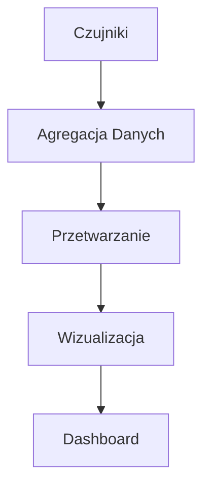
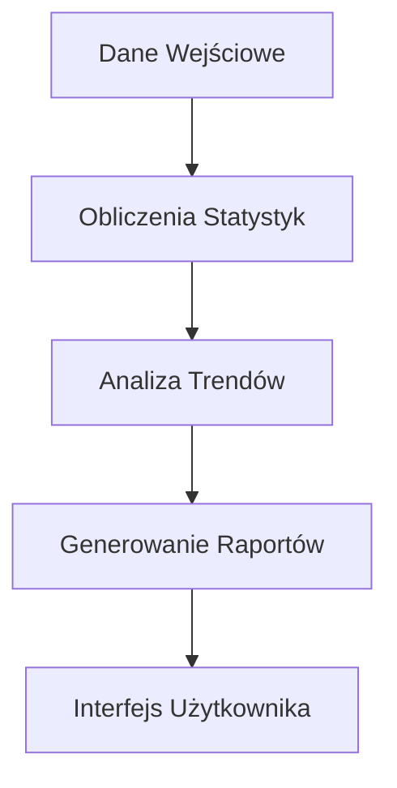
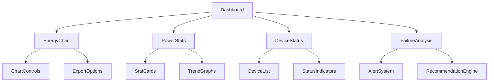

# System Architecture Documentation - Dashboard

## 1. Przegląd Systemu
System implementuje zaawansowany dashboard do monitorowania zużycia energii i zarządzania infrastrukturą energetyczną w czasie rzeczywistym. Główne funkcjonalności obejmują:
- Monitorowanie zużycia energii
- Analiza wydajności
- Status urządzeń IoT
- Analiza awarii i alertów
- Integracja z czujnikami

## 2. Główne Komponenty

### Monitoring Energii (`src/components/dashboard/EnergyChart.tsx`)
- Wizualizacja zużycia energii w czasie rzeczywistym
- Różne typy wykresów (liniowy, słupkowy, złożony)
- Możliwość eksportu danych do PDF/JPG
- Funkcje przybliżania i przewijania
- **Punkty dostosowania:**
  - Zmiana kolorów wykresu: `stroke="#ef4444"` dla linii
  - Dostosowanie legendy: komponent `Legend`
  - Modyfikacja tooltipów: komponent `CustomTooltip`

### Statystyki Mocy (`src/components/dashboard/PowerStats.tsx`)
- Karty z kluczowymi wskaźnikami wydajności
- Animowane wskaźniki statusu
- Interaktywne wykresy trendów
- **Punkty dostosowania:**
  - Modyfikacja kart statystyk: komponent `StatCard`
  - Zmiana progów statusów w `getStatusColor`
  - Dostosowanie animacji: parametry `motion.div`

### Status Urządzeń (`src/components/network/DeviceStatus.tsx`)
- Monitoring stanu transformatorów
- Status liczników energii
- Parametry czujników
- **Punkty dostosowania:**
  - Zmiana statusów urządzeń w `deviceStatuses`
  - Modyfikacja wskaźników w `StatusIndicator`
  - Dostosowanie alertów w `AlertBadge`

### Analiza Awarii (`src/components/network/FailureAnalysis.tsx`)
- Identyfikacja potencjalnych problemów
- Rekomendacje działań naprawczych
- Historia awarii
- **Punkty dostosowania:**
  - Modyfikacja priorytetów alertów w `priorityLevels`
  - Dostosowanie rekomendacji w `recommendations`
  - Zmiana filtrów w `FilterSection`

## 3. Przepływ Danych

### Monitoring w czasie rzeczywistym

### Analiza Wydajności

## 4. Kluczowe Technologie
- **Wizualizacja**: Recharts
  - Łatwa modyfikacja wykresów
  - Responsywne komponenty
- **UI**: React, TypeScript, Tailwind CSS
  - Komponenty funkcyjne
  - Typowanie danych
- **Komponenty**: shadcn/ui
  - Gotowe komponenty UI
  - Możliwość customizacji
- **Animacje**: Framer Motion
  - Płynne przejścia
  - Interaktywne elementy
- **Eksport Danych**: html2canvas, jsPDF
  - Generowanie raportów
  - Różne formaty eksportu

## 5. Architektura Danych
- **Dane czujników** (`src/data/companies/`)
  - Aktualizowane w czasie rzeczywistym
  - Format JSON
- **Statystyki** (`src/components/status/IoTStatusData.ts`)
  - Generowane na podstawie historycznych pomiarów
  - Możliwość dostosowania progów
- **Wskaźniki wydajności** (`src/components/dashboard/PowerStats.tsx`)
  - Obliczane w locie
  - Konfigurowalne progi alertów
- **Historia alertów** (`src/components/network/FailureAnalysis.tsx`)
  - Przechowywana lokalnie
  - Możliwość filtrowania

## 6. Planowane Ulepszenia
1. Implementacja zaawansowanych algorytmów predykcyjnych
2. Rozszerzenie możliwości eksportu danych
3. Dodanie więcej typów wizualizacji
4. Integracja z systemami zewnętrznymi
5. Optymalizacja wydajności dla dużych zbiorów danych

## 7. Struktura Komponentów

## 8. Kluczowe Miejsca do Dostosowania

### Dane Firm (`src/data/companies/`)
- Modyfikacja danych firm
- Dodawanie nowych wskaźników
- Zmiana struktury danych

### Komponenty UI (`src/components/ui/`)
- Dostosowanie stylów
- Modyfikacja komponentów
- Dodawanie nowych elementów

### Tłumaczenia (`src/i18n/translations/`)
- Dodawanie nowych języków
- Modyfikacja istniejących tłumaczeń
- Dostosowanie formatowania

### Konfiguracja Wykresów (`src/components/dashboard/`)
- Zmiana typów wykresów
- Dostosowanie kolorystyki
- Modyfikacja interakcji

### System Alertów (`src/components/network/`)
- Konfiguracja progów alertów
- Dostosowanie priorytetów
- Modyfikacja powiadomień