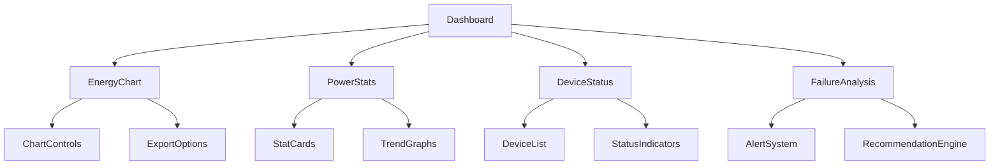

# System Architecture Documentation - Dashboard

## Overview
System implementuje zaawansowany dashboard do monitorowania zużycia energii i zarządzania infrastrukturą energetyczną w czasie rzeczywistym.

## Główne Komponenty

### Monitoring Energii
- **Energy Chart** (`src/components/dashboard/EnergyChart.tsx`)
  - Wizualizacja zużycia energii w czasie rzeczywistym
  - Różne typy wykresów (liniowy, słupkowy, złożony)
  - Możliwość eksportu danych do PDF/JPG
  - Funkcje przybliżania i przewijania

### Statystyki Mocy
- **Power Stats** (`src/components/dashboard/PowerStats.tsx`)
  - Karty z kluczowymi wskaźnikami wydajności
  - Animowane wskaźniki statusu
  - Interaktywne wykresy trendów
  - Szczegółowe statystyki po rozwinięciu

### Status Urządzeń
- **Device Status** (`src/components/network/DeviceStatus.tsx`)
  - Monitoring stanu transformatorów
  - Status liczników energii
  - Parametry czujników
  - Wskaźniki wydajności

### Analiza Awarii
- **Failure Analysis** (`src/components/network/FailureAnalysis.tsx`)
  - Identyfikacja potencjalnych problemów
  - Rekomendacje działań naprawczych
  - Historia awarii
  - Priorytety alertów

## Przepływ Danych

1. **Monitoring w czasie rzeczywistym**
   ```mermaid
   graph TD
     A[Czujniki] --> B[Agregacja Danych]
     B --> C[Przetwarzanie]
     C --> D[Wizualizacja]
     D --> E[Dashboard]
   ```

2. **Analiza Wydajności**
   ```mermaid
   graph TD
     A[Dane Wejściowe] --> B[Obliczenia Statystyk]
     B --> C[Analiza Trendów]
     C --> D[Generowanie Raportów]
     D --> E[Interfejs Użytkownika]
   ```

## Kluczowe Technologie

- **Wizualizacja**: Recharts
- **UI**: React, TypeScript, Tailwind CSS
- **Komponenty**: shadcn/ui
- **Animacje**: Framer Motion
- **Eksport Danych**: html2canvas, jsPDF

## Architektura Danych

- Dane czujników aktualizowane w czasie rzeczywistym
- Statystyki generowane na podstawie historycznych pomiarów
- Wskaźniki wydajności obliczane w locie
- Historia alertów przechowywana lokalnie

## Planowane Ulepszenia

1. Implementacja zaawansowanych algorytmów predykcyjnych
2. Rozszerzenie możliwości eksportu danych
3. Dodanie więcej typów wizualizacji
4. Integracja z systemami zewnętrznymi
5. Optymalizacja wydajności dla dużych zbiorów danych

## Struktura Komponentów
